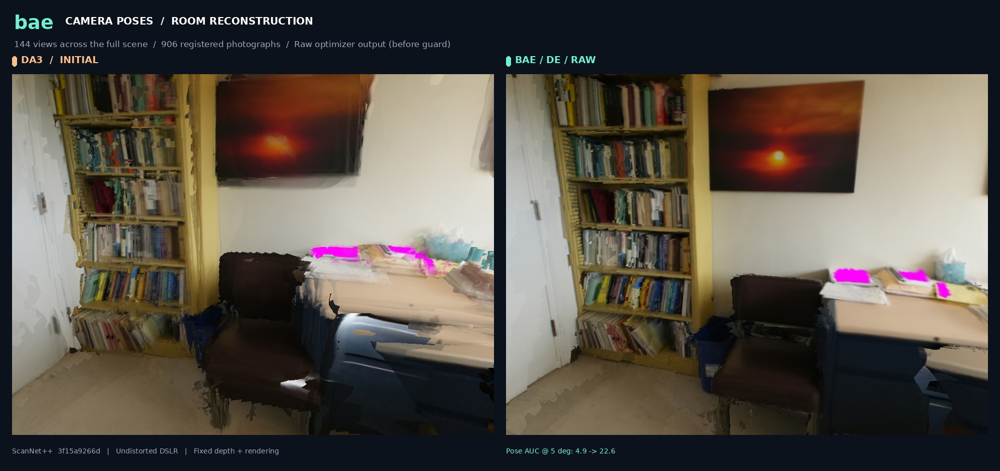

# RGB-D Pose Refinement

A `bae` example: refine a set of noisy camera poses for an RGB-D scene by
directly minimizing photometric (image-intensity) disagreement between
views, solved as a single joint sparse Levenberg–Marquardt problem on GPU.

[](docs/showcase/index.html)

**[Interactive DSLR showcase](docs/showcase/index.html)** ·
**[33-second room refinement film](docs/showcase/room_refinement.mp4)** ·
**[Full validation results](docs/validation/RESULTS.md)**

**[Full GIANT-1.1 validation with PyPose ambient gradients](VALIDATION.md)**
provides the complete split comparison. Three new gallery scenes use these
corrected runs: a monitor office, lecture room and kitchenette, each with 156
undistorted DSLR views sampled across the entire scene. The gallery includes
3D camera tours, detail sliders and matched D / E / D+E renders. Their raw
AUC@5 improves from 37.5 → 69.0, 56.9 → 73.8 and 45.9 → 65.2 respectively.

The approved bookshelf image above retains its original 144-view nested-model
run (AUC@5 4.9 → 22.6), labeled historical in the gallery. All selected examples
show raw refinement; the current photometric guard rejects those proposals.
Raw and returned results are reported separately.
See [SHOWCASE.md](SHOWCASE.md) for installation, reproduction, rendering details,
and the comparison with the real DA3 reference implementations.

## What this does

Given a set of RGB-D views with approximate initial poses (e.g. from visual-
inertial odometry, or any other rough estimator), this example refines those
poses in two stages, both implemented as native `bae` sparse-LM problems
(no external solver, no CPU fallback):

1. **Odometry** — treats every pair of nearby views as a photometric
   constraint (does the warped image from view *i* match view *j*?) and
   solves for *all* views' poses jointly in one sparse system, instead of
   pairwise-then-averaging.
2. **Structure** — fuses the current views into a single point cloud, then
   refines every pose against that shared structure.

A cheap, pose/depth-free self-calibration step corrects small camera-intrinsics
errors before either stage runs (dense photometric refinement is sensitive
to focal-length error, and this is close to free insurance against it). Two
guards — a texture check and a trust-region accept/reject — keep the
refinement from making things worse on scenes that don't support it (e.g.
blank walls, or already-good poses).

Everything (correspondence search, structure fusion, visibility resolution)
is implemented as batched GPU tensor ops — see the module docstrings in
`photometric.py`, `covis.py`, and `guards.py` for exactly how each step is
vectorized, and `visualize.py` for how the GIF above is generated.

## Install

```bash
pip install --no-build-isolation -v -e .        # base bae install, from repo root
pip install opencv-python lz4                    # this example's extra deps
pip install viser                                # only needed to regenerate the demo GIF
```

Regenerating the GIF also needs a Chrome/Chromium binary on `$PATH` (used
headlessly to drive the WebGL render — see `visualize.py`).

## Quickstart

```bash
# Sanity-check the math/API first (fast, no dataset needed):
pytest examples/rgbd_pose_refine/tests/

# Regenerate the demo GIF above:
python examples/rgbd_pose_refine/visualize.py

# Run on a real ScanNet++ scene:
python examples/rgbd_pose_refine/run_refine.py --scene_id 7831862f02 --stage odometry+structure
```

The CLI prints a self-calibration line, a texture-gate verdict, per-step LM
loss, an accept/reject verdict per stage, and a pose-accuracy comparison
before/after, then saves the refined poses to `examples/rgbd_pose_refine/save/`.

## Dataset

Expects ScanNet++'s iPhone RGB-D captures (real LiDAR depth + IMU-based
initial pose/intrinsics). See `dataset.py` for the exact expected layout and
`--dataset_root`/`--frames_root`/`--video_root` to point at your own copy.

## Files

| File | Role |
|---|---|
| `geometry.py` | Camera projection/back-projection/image-sampling primitives |
| `covis.py` | Which view pairs are close enough to constrain each other |
| `selfcal.py` | Pose/depth-free intrinsics self-calibration |
| `guards.py` | Texture gate + trust-region accept/reject |
| `photometric.py` | The two refinement stages (odometry, structure) |
| `dataset.py` | ScanNet++ iPhone data loader |
| `eval.py` | Pose-accuracy evaluation against ground truth |
| `synthetic_scene.py` | Small dataset-free scene generator, used by tests and `visualize.py` |
| `run_refine.py` | CLI entry point |
| `visualize.py` | Renders the demo GIF above (viser + headless Chrome) |

## CLI reference

| Flag | Default | Meaning |
|---|---|---|
| `--scene_id` | required | ScanNet++ scene id |
| `--max_views` | 60 | frame subsample size |
| `--stage` | `odometry+structure` | `odometry`, `structure`, or both in sequence |
| `--selfcal` / `--no-selfcal` | on | intrinsics self-calibration |
| `--tex-gate` | 0.003 | texture-gate threshold (resolution-dependent, see `guards.py`) |
| `--reject-on-regression` | on | trust-region accept/reject per stage |
| `--pyramid-levels`, `--n-relin`, `--n-inner` | 3, `3,2,1`, 5 | coarse-to-fine schedule |
| `--device`, `--dtype` | `cuda`, `float64` | |
| `--out` | auto | output path |

Run `--help` for the full list (covisibility gating, structure-stage
sub-parameters, etc.).

## Notes on scope

Dense photometric refinement has a couple of known failure modes worth
knowing about before pointing this at a new dataset: it can degrade poses on
near-static/low-parallax view sets (an "aperture problem"-like ambiguity —
mitigate with `--min-baseline-frac`/`--min-rot-deg`), and the texture-gate
threshold is tuned for a specific image resolution. Both are documented
where they're handled, in `guards.py` and `covis.py`.
