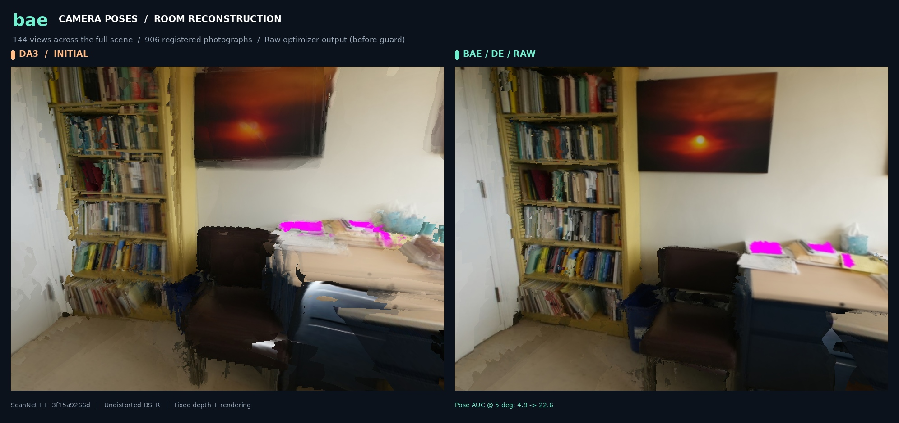

# RGB-D Pose Refinement

A `bae` example: refine a set of noisy camera poses for an RGB-D scene by
directly minimizing photometric (image-intensity) disagreement between
views, solved as a single joint sparse Levenberg–Marquardt problem on GPU.

[](docs/showcase/index.html)

**[Interactive DSLR showcase](docs/showcase/index.html)** ·
**[33-second room refinement film](docs/showcase/room_refinement.mp4)** ·
**[Full validation results](docs/validation/RESULTS.md)**

**[Full GIANT-1.1 validation with PyPose ambient gradients](VALIDATION.md)**
provides the complete split comparison. Three new gallery scenes use these
corrected runs: a monitor office, lecture room and kitchenette, each with 156
undistorted DSLR views sampled across the entire scene. The gallery includes
3D camera tours, detail sliders and matched D / E / D+E renders. Their raw
AUC@5 improves from 37.5 → 69.0, 56.9 → 73.8 and 45.9 → 65.2 respectively.

The approved bookshelf image above retains its original 144-view nested-model
run (AUC@5 4.9 → 22.6), labeled historical in the gallery. All selected examples
show raw refinement; the current photometric guard rejects those proposals.
Raw and returned results are reported separately.
See [SHOWCASE.md](SHOWCASE.md) for installation, reproduction, rendering details,
and the comparison with the real DA3 reference implementations.

## What this does

Given ScanNet++ DSLR photographs, DA3 predicts depth, intrinsics, and initial
camera poses. This example refines those poses in two stages, both implemented
as native `bae` sparse-LM problems
(no external solver, no CPU fallback):

1. **Odometry** — treats every pair of nearby views as a photometric
   constraint (does the warped image from view *i* match view *j*?) and
   solves for *all* views' poses jointly in one sparse system, instead of
   pairwise-then-averaging.
2. **Structure** — fuses the current views into a single point cloud, then
   refines every pose against that shared structure.

An optional, pose/depth-free self-calibration step corrects camera intrinsics
before refinement. The benchmark chains raw odometry and structure updates,
then guards the complete proposal against a fixed held-out photometric score.
Both raw and guarded poses are saved. That score is a proxy: acceptance does
not guarantee better ground-truth pose accuracy.

Everything (correspondence search, structure fusion, visibility resolution)
is implemented as batched GPU tensor ops — see the module docstrings in
`photometric.py`, `covis.py`, and `guards.py` for exactly how each step is
vectorized. See [SHOWCASE.md](SHOWCASE.md) for rendering real DSLR scenes.

## Install

```bash
pip install --no-build-isolation -v -e .        # base bae install, from repo root
pip install opencv-python                       # image loading and self-calibration
```

The DSLR showcase dependencies and rendering commands are documented in
[SHOWCASE.md](SHOWCASE.md).

## Quickstart

The evaluation uses DSLR images. All commands run from the repository root.

| Entry point | Inputs | Refinement and guard behavior |
|---|---|---|
| `benchmark/showcase_prepare.py` → `benchmark/showcase_benchmark.py` | DSLR photographs → cached DA3 depth and poses | Raw D then E; guard the complete proposal; save both raw and guarded results |
| `space/` (optional hosted app) | Uploaded photographs or cached examples | Display raw D/E history and report a guard verdict using the plotted held-out scores |

The DSLR benchmark defaults use 512 samples per pair and baseline/rotation
gates of 0.1/1°.

```bash
# Sanity-check the math/API first (fast, no dataset needed):
pytest examples/rgbd_pose_refine/tests/

# Prepare DSLR predictions after installing the DA3 dependencies in SHOWCASE.md.
python examples/rgbd_pose_refine/benchmark/showcase_prepare.py \
  --scenes 7831862f02 --dataset-root /path/to/scannetpp \
  --out outputs/rgbd_showcase --device 0

# BAE-only DSLR refinement, after preparing prediction.npz for this scene.
python examples/rgbd_pose_refine/benchmark/showcase_benchmark.py \
  --scenes 7831862f02 --variants bae_d bae_e bae_de
```

See [SHOWCASE.md](SHOWCASE.md) for DSLR prediction preparation and rendering,
or [VALIDATION.md](VALIDATION.md) for the full split protocol. Cached-prediction
BAE runs need no reference implementation; requesting `form_d`, `form_e`, or
`form_de` requires the separate `da3/refine_poses.py` checkout and dependencies.

Preparation writes `prediction.npz` and `input.json` under
`outputs/rgbd_showcase/<scene>/`. The benchmark writes raw and guarded poses
and optimization histories to `refined.npz`, with pose accuracy and guard
verdicts in `metrics.json`.

## Dataset

The DSLR loader expects these ScanNet++ archives:

```text
<dataset-root>/data/<scene>/dslr/colmap.zip
<dataset-root>/data/<scene>/dslr/resized_images.zip
```

`colmap.zip` contains `colmap/cameras.txt` and `colmap/images.txt`. `dslr.py`
uses the camera model to undistort the photographs and reads COLMAP poses for
evaluation. DA3 supplies initial depth, intrinsics, and poses; the optimizer
never receives the COLMAP evaluation poses.

## Files

| File | Role |
|---|---|
| `geometry.py` | Camera projection/back-projection/image-sampling primitives |
| `covis.py` | Which view pairs are close enough to constrain each other |
| `selfcal.py` | Pose/depth-free intrinsics self-calibration |
| `guards.py` | Held-out photometric scoring and trust-region accept/reject |
| `photometric.py` | The two refinement stages (odometry, structure) |
| `dslr.py` | ScanNet++ DSLR loader and undistortion |
| `eval.py` | Pose-accuracy evaluation against ground truth |
| `tests/_scene_fixture.py` | Textured-plane fixture for numerical correctness tests |
| [`benchmark/`](benchmark/README.md) | Prediction preparation, comparisons, split validation, reports |
| [`visualization/`](visualization/README.md) | Rendering, videos, tours, and gallery generation |
| `space/` | Optional hosted app and its deployment scripts; vendor copies are generated |
| `docs/` | Published galleries and validation artifacts; not imported by the solver |

## DSLR benchmark CLI reference

| Flag | Default | Meaning |
|---|---|---|
| `--scenes` | `7831862f02` | Scene IDs with cached predictions |
| `--out` | `outputs/rgbd_showcase` | Root directory of prediction and refinement caches |
| `--variants` | All six methods | Use `bae_d bae_e bae_de` for BAE-only refinement |
| `--selfcal` / `--no-selfcal` | on | intrinsics self-calibration |
| `--neighbors` | 16 | Neighbors in the odometry covisibility graph |
| `--samples` | 512 | Sampled pixels per pair for BAE odometry |
| `--structure-points` | 5000 | Maximum structure points per view |
| `--device` | 0 | CUDA device index |
| `--force` | off | Recompute cached refinement results |

Run `benchmark/showcase_benchmark.py --help` for all refinement options.
Prediction settings such as `--model`, `--revision`, `--max-views`, and
`--dataset-root` belong to `benchmark/showcase_prepare.py`.

## Notes on scope

Dense photometric refinement can degrade poses on near-static or low-parallax
view sets. The benchmark uses baseline and rotation gates when building
odometry constraints; see `covis.py`. The photometric guard is also imperfect,
so evaluate the saved raw and guarded results separately.
